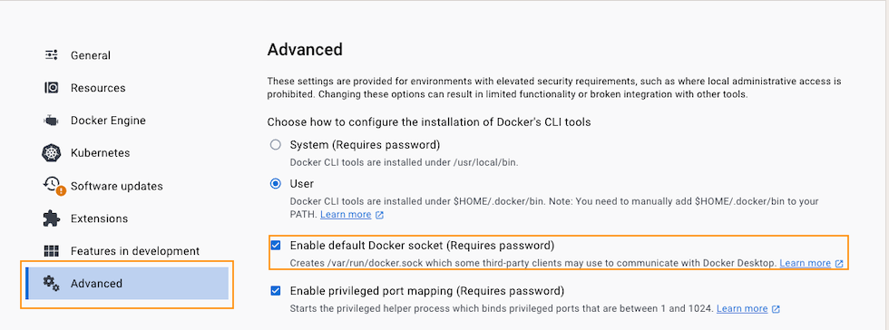

# WebSocket Server for Docker Management

## Features

- WebSocket communication with clients.
- Execution of shell commands inside Docker containers.
- Real-time logging and monitoring of command execution.

## Prerequisites

- Docker
- Docker Compose
- (MacOS only) /var/run/docker.sock MacOS Docker Desktop advanced feature `enabled`


## Getting Started

These instructions will get your copy of the project up and running on your local machine for development and testing purposes.

### Installation
1. **Build and start the server using Docker Compose:**

   ```bash
   # Spin up the stack
   docker compose -f .devops/docker-compose.yaml up -d --build --force-recreate --remove-orphans
   
   # Spin down the stack
   docker compose -f .devops/docker-compose.yaml down --remove-orphans
   ```

   This command will build the Docker image for the WebSocket server and start it. The server will be listening on port 4242.

### Usage

Once the server is running, you can connect to it using any WebSocket client. The client can send shell commands to be executed inside a Docker container managed by the server.

## Development

### Project Structure

- `.devops`: Contains docker assets (Dockerfile, Docker-compose file)
- `main/main.go`: The entry point for the WebSocket server.
- `docker/docker.go`: Contains the Docker client logic for interacting with Docker containers.
- `go.mod` and `go.sum`: Go module files.

### Customizing the Server

You can customize the server by modifying the `main/main.go` file and the associated Docker client logic in the `docker/` directory.

## Contributing

Please read CONTRIBUTING.md for details on our code of conduct, and the process for submitting pull requests to us.

## Versioning

For the versions available, see the [tags on this repository](https://github.com/yourusername/your-repo/tags).

## Authors

- **Your Name** - *Initial work* - [YourUsername](https://github.com/YourUsername)

See also the list of [contributors](https://github.com/yourusername/your-repo/contributors) who participated in this project.

## License

This project is licensed under the MIT License - see the LICENSE.md file for details

## Acknowledgments

- Hat tip to anyone whose code was used
- Inspiration
- etc
